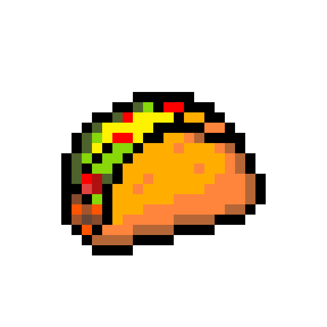

🌮 THE TACO PROJECT:

📽️ ANIMATION PREVIEW

🚀 STARTING POINT
This repository contains my first official sprite posted on GitHub.

I love making pixel art, so to keep my skills active and active, I decided to create this sprite.

🎨 The Art: A Mexican taco animated frame by frame until it is completely consumed.

🔧 The Tool: Created and animated exclusively in Piskel.

🎉 The Goal: To mark the beginning of MexicanPixel's visual identity on GitHub.

⭐ If you liked my first project, please consider giving a star to my hard and dedicated work.

✍️ AUTHOR: MexicanPixel.  
